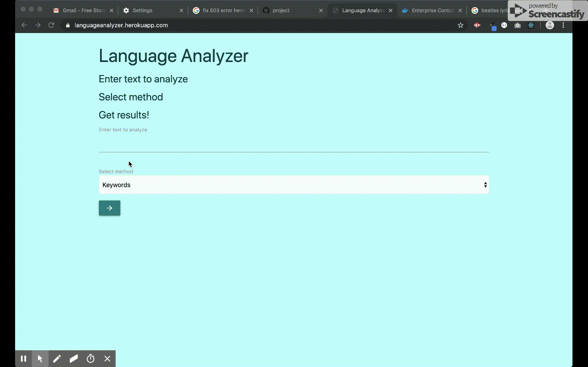
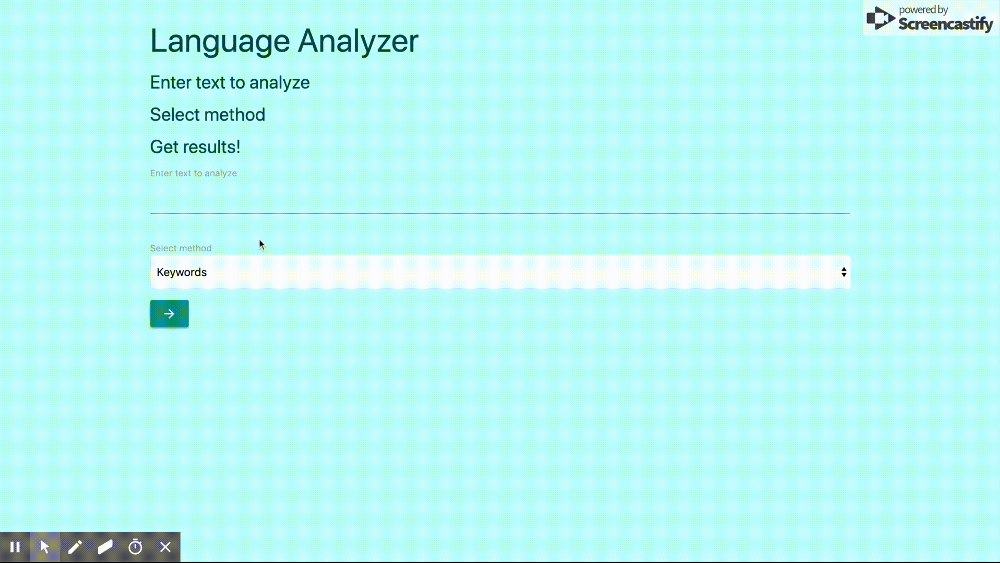
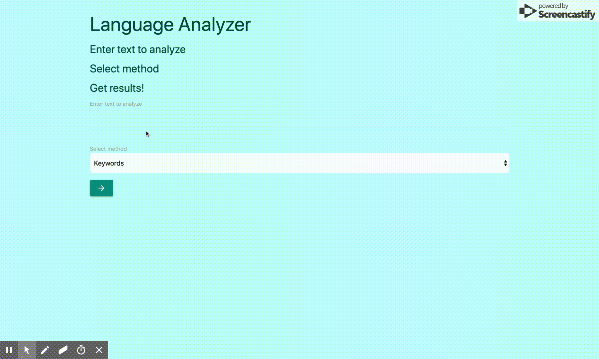

# ibm-watson-language-analyzer

## Planning
[User Stories & Wireframes](https://github.com/zoe-gonzales/ibm-watson-language-analyzer/tree/master/planning)

## Overview
Users can enter any text that they would like to analyze for keywords, categories, or emotions data. App will return results from IBM's Watson [Natural Language Understanding API](https://www.ibm.com/cloud/watson-natural-language-understanding).

## Technologies
[Go](https://golang.org/)  
[Echo](https://echo.labstack.com/)  
[React](https://reactjs.org/)  
[Materialize](https://materializecss.com/)
[Docker](https://www.docker.com/)

## Deployed
You can visit the deployed app [here](https://languageanalyzer.herokuapp.com/)

## How to use / demo
Enter text that you'd like to analyze and select the method: Keywords, Categories or Emotions.

* **Keywords** returns a list of the keywords found, their relevance in the text, and how many times each one appears.
* **Categories** returns a list of categories and sub-categories and each one's relevance in the text.
* **Emotions** returns a score between 0 and 1 weighing the relevance of each of the following in the entered text: Anger, Disgust, Fear, Joy, Sadness.

