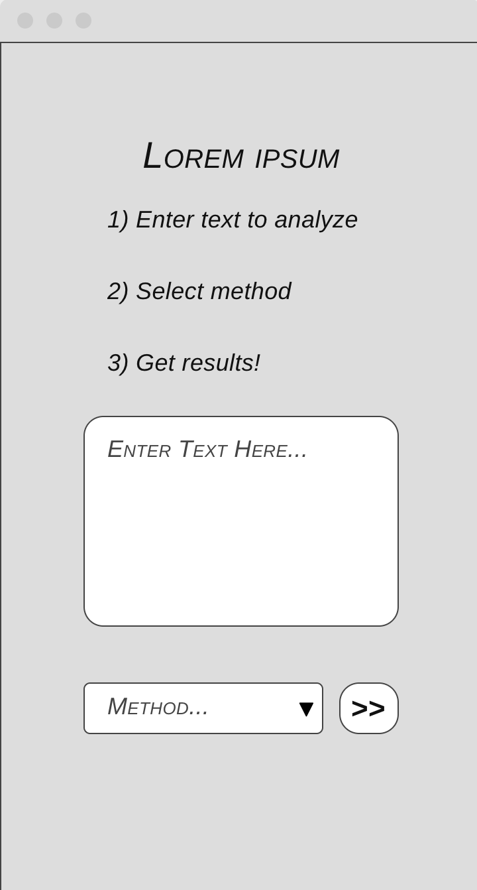
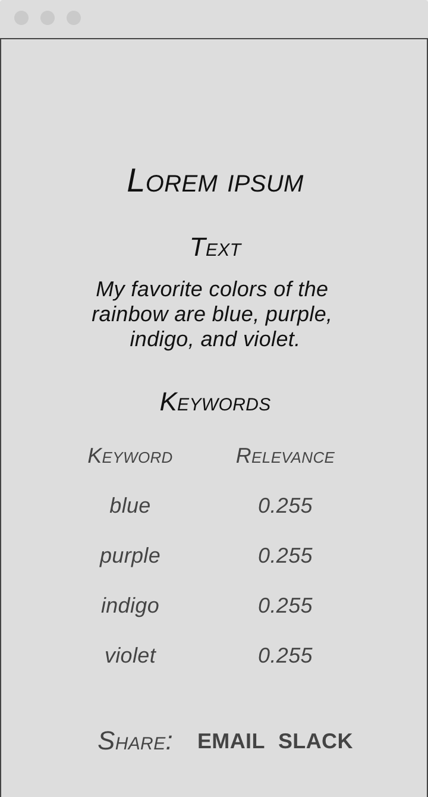
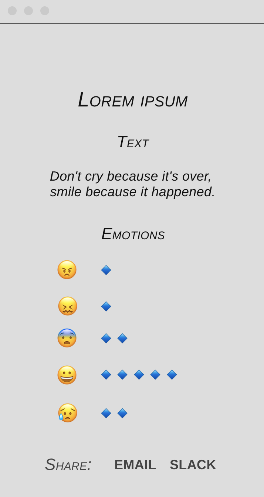
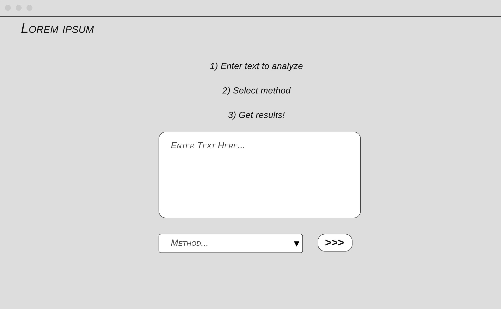
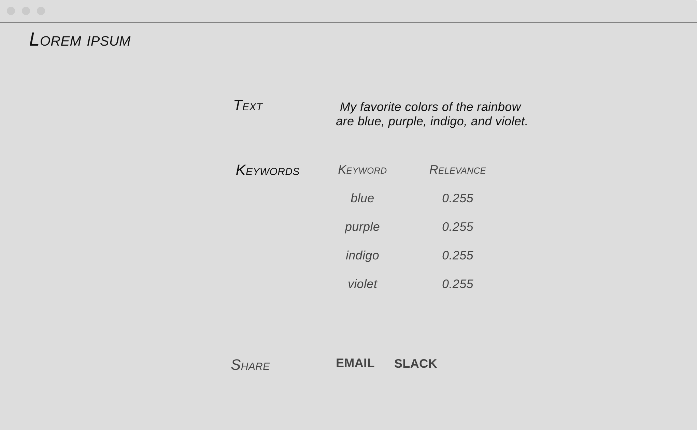
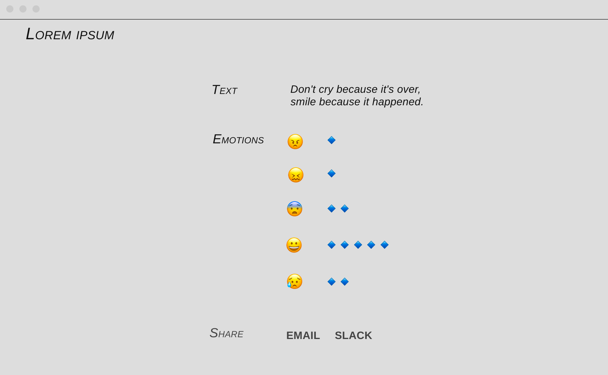

## Planning

#### User Stories

**MVP**

As a user,
I want a simple and efficient way to get a list of relevant keywords
to tag my article or tweet.

As a user,
I want to input text and get back a list of keywords
so that I can optimize my search results.

As a user,
I want to input text and get back a list of categories
so that I can create a system for categorizing articles on my blog/site.

As a user,
I want to input text and get back an analysis of the emotions the text conveys
so that I can appropriately connect with my target audience.

As a user,
I want a simple but visually appealing interface
so that I can easily find what I'm looking for.

**Features**

As a user, 
I want to be able to email or slack the results of my text analysis 
in case I have to share with a colleague or business partner.

## Wireframes

**Mobile View**

All mobile wireframes are 360px X 640px

Search Page

Results - Keywords or Categories

Results - Emotions

**Larger screens**

Search Page

Results - Keywords or Categories

Results - Emotions
